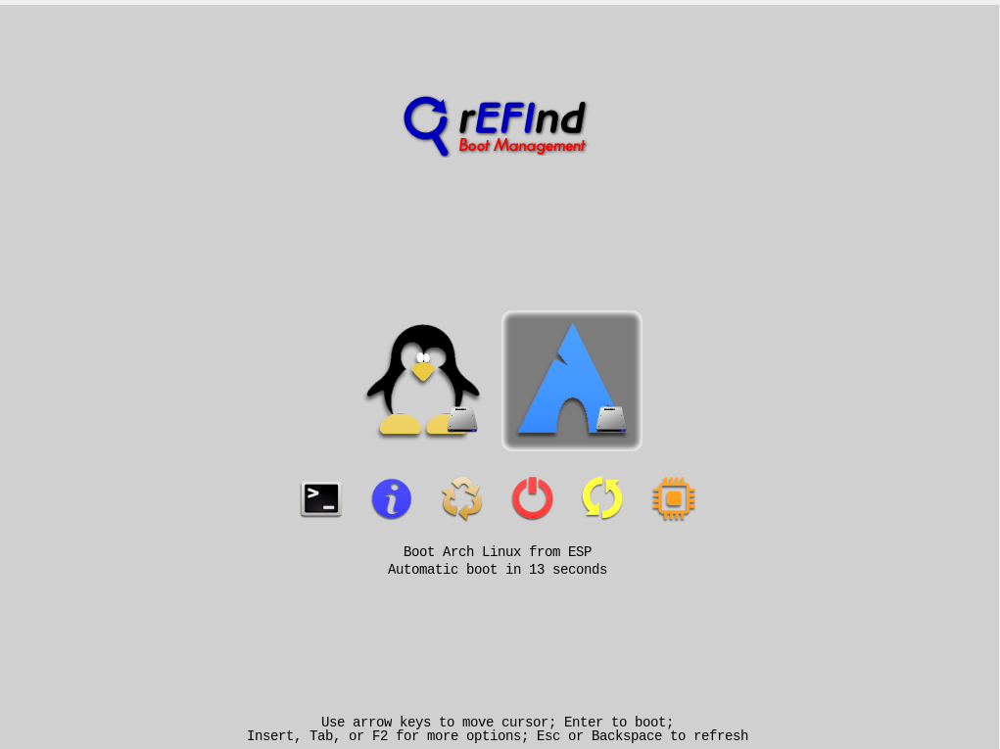

# Kolay Arch Linux Kurulumu # archyukle!

Merhaba ! kolay arch linux kurulumu ile kurulum otomatik olarak tamamlanacaktır **Test**. Aşamasındandır geliştirmeye devam ediyorum.

```bash
pacman -Sy git
git clone https://github.com/yuceltoluyag/archyukle.git
cd archyukle
chmod +x *.sh
./fulloto.sh
```

Kurulum tamamlandıktan sonra :

```bash
./paketyukle.sh pkglist.txt
```

```diff
+ Pkglist dosyasını kendinize göre düzenlemeyi unutmayın. Mutlaka blog yazımı okuyunuz.
```

## Refind Bootloader

Grub Yerine Refind Kurmak istiyorsanız

```bash
pacman -Sy git
git clone https://github.com/yuceltoluyag/archyukle.git
cd archyukle
chmod +x *.sh
./refind.sh
```

```diff
- Refind sadece uefi sistemleri destekler.
```



# 2 Yıl Sonra gelen Güncelleme

Detaylar Muhteşem Blogumda :D [Kalitenin Bir Numaralı Adresine Hoşgeldiniz](https://yuceltoluyag.github.io/) 😅 😂 🤣

## Bir Kaç Bilgi!

**Gerek yok** ama illa ki kullanacağım diyorsanız :

`pacman -Syu` komutunu **kullanmak** isterseniz.

- Sanal makinede başlangıçta yeterli sanal disk alanı oluşturma

* Normal boot -> tab -> cow_spacesize=2G
* Uefi Boot -> mount -o remount,size=2G /run/archiso/cowspace

## virtualboxta UEFI Disk Sorunu ile Karşılaşırsanız

Virtualboxun uefi diski yerleştirmeme sorunu çözümü

- Sanal Makinenizi Başlatın.
- Karşınıza gelen ekrana şu komutları yazın :

```bash

    fs0: edit startup.nsh
    \EFI\arch_grub\grubx64.efi
    ctrl-s <basın>
    <enter>
    ctrl-q <basın>
    reset
```
